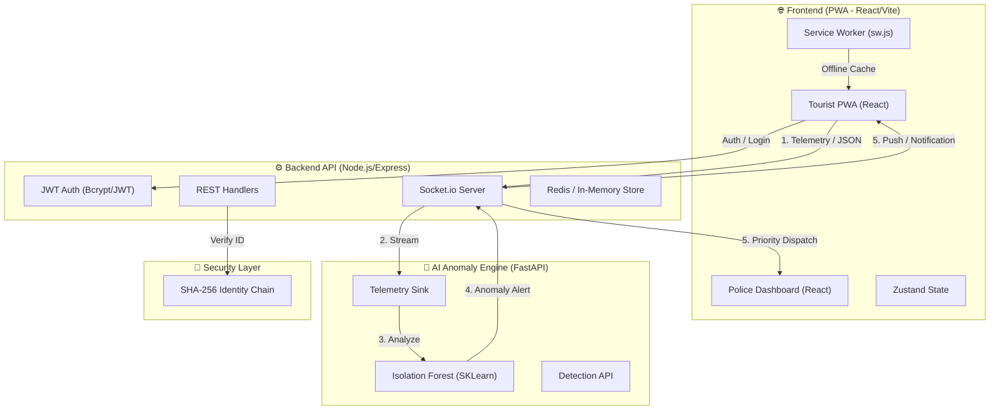

# 🏗️ TourSafe Technical Architecture

The following diagram illustrates the high-fidelity data flow between the user's PWA, the primary Backend API, and the specialized AI and Blockchain layers.



### 📡 Data Communication Protocols
-   **Real-time Binary/String**: WebSockets (Socket.io) for telemetry and alerts.
-   **RESTful APIs**: JSON over HTTPS for authentication, settings, and status.
-   **Internal Microservice RPC**: HTTP/JSON between Backend and AI Service.
-   **PWA Persistence**: IndexedDB & Cache API for offline resilience.

---

### 📂 Final Project Directory Structure

```text
MAJORPROJECTNS18/
├── ai-service/           # FastAPI Machine Learning Engine
│   ├── main.py           # ML Detection Logic
│   ├── requirements.txt
│   └── Dockerfile
├── backend/              # Node.js Express API & WebSockets
│   ├── routes/           # Role-based API Handlers
│   ├── services/         # Identity & Blockchain Logic
│   ├── tests/            # Automated API Tests
│   ├── server.js         # Entry Point
│   └── Dockerfile
├── frontend/             # React PWA (Vite + Tailwind)
│   ├── src/
│   │   ├── components/   # UI System (Sidebar, Layout)
│   │   ├── pages/        # PWA Views (Map, AI, Blockchain, Settings)
│   │   ├── store/        # Zustand Global State
│   │   └── services/     # API & Socket Clients
│   ├── public/           # PWA Manifest & Service Worker
│   └── Dockerfile
├── docker-compose.yml    # Full Ecosystem Orchestration
└── README.md             # Master Technical Manual
```

---
*The TourSafe project is now ready for presentation or deployment.*
